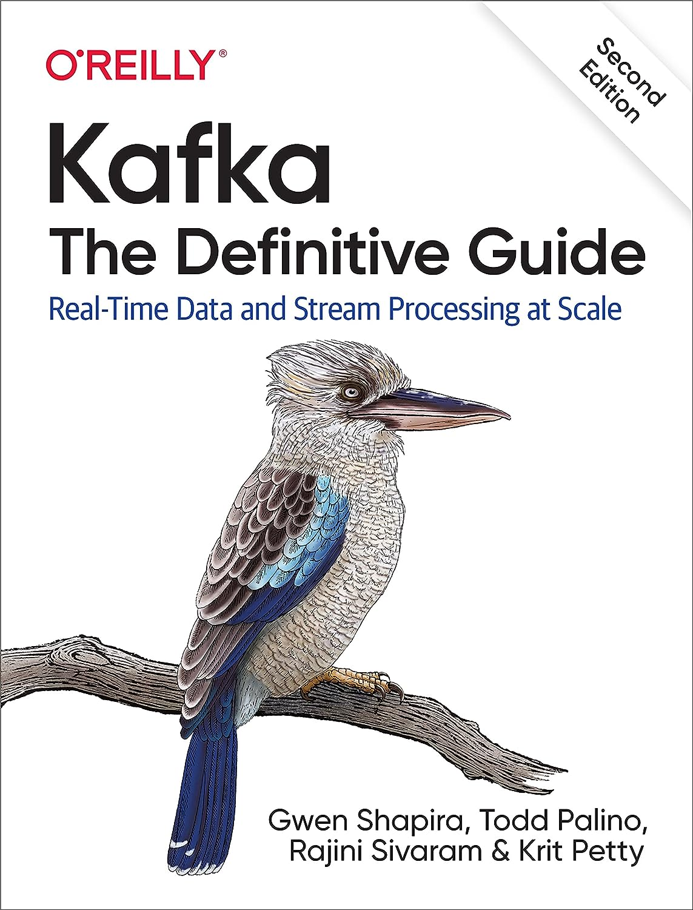

# MSDS 682 Data Streaming Processing Overview

## Course Description

This class are to equips students with the skills necessary to process continuous data streams at scale and in real-time.

Students will gain hands-on experience with Apache Kafka and other modern data engineering tools. We focus on blending foundational knowledge with hands-on skills, often using real-world examples to anchor theoretical concepts. The primary programming language for the course is Python. 

- Semester: Fall 2023
- Graduate Course in Data Engineering Track

### Instructor Inforomation 
- Jeremy W. Gu
- wgu9@usfca.edu
  
### Office Hours
- 8:45-9:30am on Wed
- Office Location: Virtual Zoom

### Prerequisite Details

To ensure your success in this course, the following knowledge prerequisites are essential:

- **Statistics:** Grasp of concepts like mean, variance, data visualization, tabular data, and pandas. Relevant courses include MSDS 504 - Review Probability and Stats and MSDS 593 - EDA and Visualization.
- **Python:** Familiarity with Python Classes and Objects. While proficiency with the Mac command line is beneficial, there will be no focus on Java or Scala in the JVM ecosystem.
- **SQL and Data Pipelines:** Knowledge derived from courses such as MSDS 681 - Data Lakehouse is ideal.
- **Machine Learning:** Familiarity with scikit-learn, supervised and unsupervised learning, evaluation of model performance, and feature selection. Courses like MSDS 621 - Intro to Machine Learning, MSDS 630 - Advanced Machine Learning, and MSDS 680 - Machine Learning Operations are recommended, though not mandatory.
- **Business Setting:** This course requires project presentations and reports. Effective and professional communication in both written and spoken English is crucial. Business writing should be concise, straightforward, and to the point. 

## Course Learning Outcomes

This applied, hands-on course provides students with the essential skills for processing and analyzing real-time data streams using modern data engineering tools and technologies. The goal is to equip students with foundational knowledge paired with practical skills in core data streaming tools and technologies like Kafka to prepare them for real-world data engineering and data science roles.

The course focuses on core concepts like the Kafka ecosystem while providing practical skills development through hands-on projects. Students will gain experience with real-time data ingestion using Kafka, conducting streaming analytics, and extracting insights. Optional materials will expose students to additional technologies like Faust and Spark Structured Streaming for building and evaluating streaming applications.

### Fundamentals

- Kafka Ecosystem: Grasp the components of data streaming systems and delve into the Kafka ecosystem, recognizing the challenges each solution addresses. Kafka remains the primary focus.

- Confluent Kafka and Confluent Cloud: Use the Confluent Kafka Python library for tasks like topic management, production, and consumption. Demonstrations will be held using Confluent Cloud.

- Real-time Data Streaming with Apache Kafka: Students will undertake a course project for hands-on experience, ingesting real-time data using Apache Kafka, conducting live analytics, and extracting insights from streaming console reports.

### Additional Skills

- Faust Stream Processing: Familiarize with the Faust Stream Processing Python library to craft real-time stream-based applications.

- Additional Tools: Time permitting, other tools will be introduced. For instance, students will explore the integration of Apache Spark Structured Streaming with Apache Kafka and understand the reports generated by the Structured Streaming console.

## Textbooks & Recommended Readings

{ align=left width=250}
**Kafka in Action**

- ISBN: 9781617295232
- Authors: Dylan Scott, Viktor Gamov, Dave Klein
- Publisher: Simon and Schuster
- Publication Date: 2022-02-15
- Required or recommended?: Recommended reading as a reference book.

{ align=left width=250}

**Kafka: The Definitive Guide**

- ISBN: 9781492043034
- Authors: Gwen Shapira, Todd Palino, Rajini Sivaram, Krit Petty
- Publisher: "O'Reilly Media, Inc."
- Publication Date: 2021-11-05
- Edition: 2nd Edition
- Required or recommended?: Recommended. Not Required.

## Assignments

There will be three Assignments and one Final Project. It's crucial to adhere to deadlines. No submissions will be accepted past the due date.

**Policy on Collaboration and Academic Integrity**

- **Group Discussions & Collaborations:** We encourage effective group discussions and collaborations. Discussing concepts, techniques, and general approaches to problems with classmates can be beneficial. However, the work you submit must be your own.
- **Originality of Work:** All submitted assignments, code, and project reports must be your own original work. Copying and pasting code or text from classmates or any other source is strictly prohibited.
- **Using AI Services (e.g., ChatGPT):** Utilizing ChatGPT or other LLM models to aid in understanding course materials is permissible. However, always write in your own words and code independently. If you incorporate insights or specific code from any AI Services, clearly indicate which part(s) were influenced or sourced from them. 
- **Online Sources & References:** If you utilize or are inspired by online sources, always provide proper citation and reference. Respect the intellectual property of others.
- **Cheating and plagiarism:** We have a zero-tolerance stance on cheating and plagiarism. Engaging in any form of academic dishonesty will result in severe penalties, which may include failure in the course.

## Grading Breakdown and Grading Policies

### Grading Breakdown

- **Attendance and Professionalism:** 5%
  - Regular attendance and active participation are expected. 
- **Individual Assignment:** 30%
  - Assignments (10% each) will assess individual understanding and application of course material.
- **Final Project:** 45%
  - Project Proposal 5%
  - Written Report 20%
  - Final Presentation 20%
- **Midterm Exam:** 20%
- **No Final Exam**

This class is a standard, graded course with letter grades A - F. Each grade reflects the quality and understanding demonstrated by the student, as follows:

**A (90-100): Exceptional understanding and application. Demonstrates depth of knowledge and skill and indicates readiness to apply concepts in a professional setting.**

- A+: 96-100

- A: 93-95

- A-: 90-92

**B (80-89): Competent understanding and application of course material, representing the expected level of competence in a business setting.**

- B+: 87-89

- B: 83-86

- B-: 80-82

**C (70-79): Basic understanding, with room for improvement in application and depth, indicating achievements lower than the expected competence in the subject.**

- C+: 77-79

- C: 73-76

- C-: 70-72

**F (Below 70): Limited understanding and application of course material, representing an unacceptably low level of knowledge and understanding of the subject matter.**

The expected class average is 85+ (Letter grade of B or above), with a normal distribution around this mean.

### Beyond Grades

While the grading system in this course is a measure of academic performance, it can also shed light on the challenges one might face in the professional realm and the manner in which these are addressed. For example, when faced with tight deadlines, how does one ensure the quality of work? How does collaboration occur within a team, especially when compromises are necessary to meet delivery dates amidst differing opinions? How well do you explain data science concepts to people with no data background, and how effective is communication with peers and superiors? How are colleagues persuaded when introducing innovative ideas? 

In reality, certain missteps or attitude problems can have severe consequences, while standout performances can bring about many opportunities in your career. These are aspects indirectly reflected in your grades. If you earn an 'A+', there’s a high probability that you will be a superstar in the workplace. Earning a 'B' is also commendable, as in a professional setting, it typically signifies "Meeting Expectations", meaning that you are performing your job. Conversely, if your grades are low, you might face significant risks of criticism from both managers and peers during performance evaluations. I hope every student can treat this course as a practical experience of the working world.

## Course Schedule

???+ warning

    This version of Course Schedule is tentative and may be delayed in updates. For the most accurate and up-to-date information, please use our course website on USF Canvas for the latest syllabus.
    

Tentative Schedule (Each lecture: 5:30 - 7:20pm PST)

- Lecture #1: Oct 20, 2023 (F) - San Francisco-101 Howard 529
- Lecture #2: Oct 24, 2023 (T) - San Francisco-101 Howard 529
- Lecture #3: Oct 27, 2023 (F) - San Francisco-101 Howard 529
- Assignment #1: Due by 11:59pm on 10/28/2023
- Lecture #4: Oct 31, 2023 (T) - San Francisco-101 Howard 529
- Lecture #5: Nov 03, 2023 (F) - San Francisco-101 Howard 529
- Assignment #2: Due by 11:59pm on 11/4/2023
- Lecture #6: Nov 07, 2023 (T) - San Francisco-101 Howard 529
- Lecture #7: Nov 10, 2023 (F) - San Francisco-101 Howard 529 | 60-min Midterm Exam
- Lecture #8: Nov 14, 2023 (T) - San Francisco-101 Howard 529
- Final Project Proposal: Due by 11:59pm on 11/13/2023
- Lecture #9: Nov 17, 2023 (F) - San Francisco-101 Howard 527
- Lecture #10: Nov 21, 2023 (T) - San Francisco-101 Howard 529
- Assignment #3: Due by 11:59pm on 11/22/2023
- Lecture #11: Nov 24, 2023 (F) - San Francisco-101 Howard 529 | Thanksgiving: No Class
- Lecture #12: Nov 28, 2023 (T) - San Francisco-101 Howard 529
- Lecture #13: Dec 01, 2023 (F) - San Francisco-101 Howard 529
- Final Project Written Report and Code: Due by 11:59pm on 12/3/2023
- Final Project Presentation Deck: Must be submitted before the final lecture 5:30pm on 12/5/2023
- Lecture #14: Dec 05, 2023 (T) - San Francisco-101 Howard 157
    - Note: This lecture is allocated for the Final Project Presentation. Each student has a about 12-minute presentation slot.

## Attendance Policy

- **Mandatory attendance** for every lecture. 
- **Use of Laptops:** Please keep your laptops closed unless instructed otherwise, specifically during demo or exercise sessions. This is to ensure focus and participation during lectures.
- **Absence Due to Illness:** If you are unable to attend a lecture due to sickness or any other unavoidable circumstance, please notify me in advance. 
- **No Distractions:** Mobile phones and other electronic devices should be kept silent and should not be used during class time. 

## Lecture references

