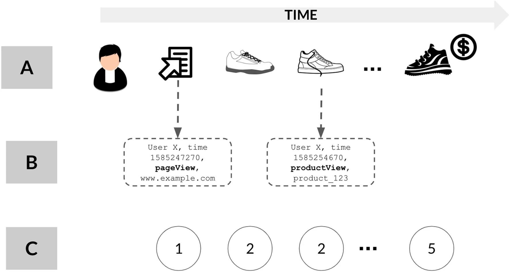
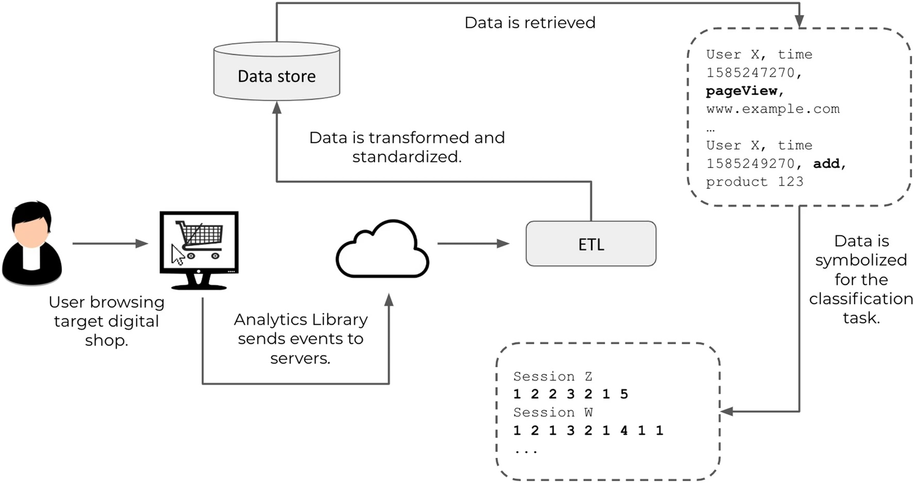

# Lec 1: Additional Topics

Author: Jeremy Gu

!!! note

    In each lecture, we will have a section called "Additional Topics" covering concepts that, due to our fast-paced curriculum, we may not have time to cover in class. However, I believe understanding these is important for fully mastering data streaming. I may also include recommended readings and coding exercises to reinforce your learning. Note that additional topics will not be on the midterm exam. In your future work, I encourage revisiting these to strengthen your data streaming knowledge. 

## Message Queues

We introduce an example to demonstrate the concepts of Message Queues and Invented Systems in the context of an e-commerce website.

Let's revisit the e-commerce website example to illustrate these concepts:

### E-commerce Website Example

**Scenario:** A customer places an order on an e-commerce website. Upon this action, the system needs to:

- Create an order ID.
- Process payment.
- Inform the warehouse for packaging.
- Send delivery information to USPS or FedEx for shipping.

**Case 1: Synchronous Processing**

- User clicks “Place Order.”
- The system begins all tasks one by one.
    - First, it creates an order ID.
    - Next, it processes the payment.
    - After that, it informs the warehouse.
    - Finally, it sends the delivery information to USPS or FedEx.
- **Synchronous**: Only after all these tasks are completed does the user receive a response.
- This Synchronous Processing doesn't use message queue. The user might have to wait a significant amount of time before getting feedback. 

**Case 2: Asynchronous Processing with Message Queue**

- User clicks “Place Order.”
- The system quickly creates an order ID and sends the user a response that their order is being processed.
- The subsequent tasks (payment processing, notifying the warehouse, sending delivery info) are queued up in a message queue and are handled separately without making the user wait.
- The **message queue** acts as an intermediary, helping different services work together asynchronously, enhancing the system's responsiveness and decoupling.

**Decoupling**
- In the context of our example, **decoupling** means that different parts of the system (e.g., payment processing, warehouse notifications, and shipping notifications) operate independently. If one part fails or is slow, it doesn't directly impact the other parts. The use of a message queue helps in achieving this by allowing these parts to communicate without being directly connected.

**Asynchronous**
- Tasks or operations do not wait for the previous one to complete. They can start, run, and complete in overlapping time periods. In our example, after placing the order, the user doesn't have to wait for all tasks to complete. They immediately get feedback, while the system processes other tasks in the background.

**Synchronous**
- Tasks or operations happen in a specific order. Each task waits for the previous one to finish before starting. In our e-commerce example, it would mean the user waits for every single task to complete before getting any feedback.

--- 

## Append-only

**Append-only logs** serve as a fundamental mechanism both in stream processing and traditional SQL databases, but with different primary focuses. 

In streaming, they're vital for ensuring the real-time recording of events with guaranteed ordering, even at high rates. On the other hand, in conventional SQL databases, these logs primarily record and synchronize data changes between database nodes, ensuring data consistency.

It's essential to recognize the diverse applications of this mechanism across various technological domains, highlighting its versatility and fundamental role in data management. This dual application elucidates the need for precision when adopting append-only logs, depending on the specific requirements and constraints of the given context.

| Feature/Characteristic | Stream Processing | Traditional SQL Databases  |
|-----------------------|--------------------------------------|---------------------------------------------|
| **Primary Use**       | High-throughput stream processing     | Data synchronization and backup              |
| **Core Concept**      | Append-only logs ensure data ordering and immutability | Append-only or "write-ahead logs" record and synchronize all changes |
| **Application**       | Real-time event recording, saved in the order they are received | Data synchronization between primary and secondary database nodes |
| **Benefits**          | Ensures events are correctly ordered even at high throughputs | Ensures data consistency and synchronization between nodes          |
| **Limitations**       | ——                                   | Append-only logs typically not suited for stream processing but are mainly for replication and backup |

--- 

## (Optional) Log-structured Storage Systems

**1. Background**

- **Early Storage Challenges:** Traditional storage inefficiencies with random write operations due to disk seek times.
- **Solution:** Emergence of log-structured storage to prioritize sequential writes, diminishing disk seek overhead.
- **Transition:** Continued relevance of log-structured storage with SSDs due to inherent benefits beyond disk optimization.

**2. Benefits of Log-structured Systems**

- **Efficiency:** Continuous writes to the end of the log, optimizing disk throughput with minimized disk head movement.
- **Reliability:** Non-overwriting nature provides a natural version history and lowered data corruption risk.
- **Concurrency:** Enables multiple operations to write data simultaneously, ideal for multi-core processors and distributed architectures.

**3. Common Characteristics**

- **Immutable Data & Append-Only Nature:** Fundamental to the design, once data is written, it remains unaltered. All new data is added to the end, ensuring the append-only approach.
- **Merge and Compaction:** With log growth, older or less relevant data can be pruned, and logs can be merged for better efficiency.
- **Log Files Handling:** Logs can be processed based on:
  - **Time:** Old logs might be archived or deleted after a pre-defined duration.
  - **Size:** A new log is initiated once the current one hits a certain size.

**4. Challenges and Solutions**

- **Data Retrieval:** Efficiently finding older data in sequential storage.
  - **Solution:** Leveraging indexing and SSTables for speedy data segment access.
- **Garbage Collection:** Identifying and eliminating obsolete data over time.
  - **Obsolete Data Example:** In a user activity log, a record showing a user liked a post followed by an entry indicating they unliked it can render the former redundant.

**5. Real-World Applications**

- **Apache Kafka:** Adopted by corporations like LinkedIn for real-time activity tracking and analysis. Application scenario: Streamlining real-time analytics for website interactions.
- **Apache Cassandra:** Chosen by businesses like Instagram for large data volumes with high availability demands. Application scenario: Managing user profiles and activity feeds with low latency.
- **Apache HBase:** Used by Facebook for storing vast quantities of messages and posts, given its capacity to handle large, sparse datasets. Application scenario: Real-time analytics on user interactions and content delivery.

--- 

## Lambda Architecture vs Kappa architecture

Lambda Architecture is a data processing architecture that uses both batch and stream-processing methods. Stream-processing is fast and caters to real-time requirements, while batch processing is thorough and handles large datasets. By combining the two, we can handle real-time data analytics without losing the depth that comes with batch processing. The beauty of Lambda Architecture is that it offers the best of both worlds: **you get a snapshot of the present moment and also a detailed picture of the past**. Here is Lambda Architecture from Databricks that covers [more details](https://www.databricks.com/glossary/lambda-architecture).

Example: Think of a social media platform where users post content and interact with one another. The platform wants to understand what's trending right now, but also wishes to make in-depth analyses periodically.

- Speed Layer (Real-time): As soon as users post or interact, this data gets processed instantly, giving a real-time view of trends or popular posts. This is like looking at what's hot in the last hour or day.

- Batch Layer (Deep Analysis): Every day or week, the platform gathers all its data and performs a deep analysis, offering a comprehensive view. This could show things like the most influential users over a month or which topics consistently trended.

- Serving Layer (Combination): This is where the magic happens. It combines the real-time and the in-depth data, so that apps or analysts can get insights from both instant and historical data.

However, [a Twitter architecture article in 2021](https://blog.twitter.com/engineering/en_us/topics/infrastructure/2021/processing-billions-of-events-in-real-time-at-twitter-) describes how Twitter migrated from a **Lambda architecture** to a **Kappa-like architecture** for large-scale real-time data processing. For more information on kappa architecture, please refer to [What is the Kappa Architecture](https://hazelcast.com/glossary/kappa-architecture/).

Original **Lambda Architecture**:

- Batch layer - Process data in Hadoop using Scalding 
- Speed layer - Real-time processing using Heron
- Serving layer - TSAR to query batch and real-time results

Lambda Architecture had issues like data loss and high latency. Batch processing was also costly.

(New) **Kappa-like Architecture**: 

- Pre-processing - Data preprocessing on Kafka
- Real-time processing - Aggregation on Google Cloud Dataflow
- Serving layer - Query results from BigQuery and BigTable

Twitter migrated from a Lambda architecture to a Kappa-like architecture by removing the batch path and relying solely on real-time processing. This improved performance and costs while maintaining accuracy. Key highlights below:

- Removed the batch processing path, only real-time path remains
- Reduced latency, improved throughput and accuracy
- Simplified architecture and reduced costs
- Validated accuracy by comparing to batch results

--- 

## (Optional Reading) Real World Examples

The paper *Shopper intent prediction from clickstream e-commerce data with minimal browsing information*[^1] addresses the problem of predicting whether a user will make a purchase during their session on an e-commerce website, based on their clickstream data.

Here is a summary of the clickstream prediction problem formulation for Alice's example session, used in the paper. In this case, the clickstream data from users browsing the ecommerce site is a data stream - a continuous sequence of user actions happening in real time. Each user action like a page view, add to cart, purchase etc is considered an event. The rich clickstream sessions are distilled into symbolic trajectories retaining only event types. The prediction task is to take Alice's symbolic trajectory as input and predict whether she will make a purchase in that session.

- **A->B: Getting Formatted Data From Streams** Alice's actual browsing session contains rich metadata like time, product info, etc (Layer A in Figure 1). 

- **B->C: Labeling Certain Events** This is simplified into a minimal symbolic trajectory by retaining only the event types (page view, add to cart, etc.) as integers (Layer C in Figure 1).

The window of each session: It is segmented into sessions using a 30 min threshold. Events in a session are symbolized into a sequence retaining only the event type. For Alice's session, this results in a symbolic trajectory of event types. Her actual session is simplified to a symbolic sequence of events. This symbolic sequence is used to make the purchase prediction. The authors target only these minimal symbolic trajectories (Layer C) in experiments, providing a benchmark for methods that leverage the richer session metadata (Layer A). The prediction task is to take Alice's symbolic trajectory as input and predict if she will purchase in that session. 

{ align=left width=600}

**Data Processing:**

- The raw clickstream data is sessionized and symbolized in pre-processing.
- Experiments are done on both balanced and imbalanced datasets.
- Analysis provides insights into how different amounts of clickstream data affects prediction performance.
  
**Output:**

The response is a binary prediction of whether the user will purchase something or not in that session.

* Page view event is mapped to symbol '1'
* Detail event (user views product page) is mapped to '2'
* Add event (add to cart) is mapped to '3'
* Remove event (remove from cart) is mapped to '4'
* Purchase event (buy product) is mapped to '5'
* Click event (click result after search) is mapped to '6'

**Machine Learning Approach:**

- The paper compares two approaches:
  - Hand-crafted feature engineering with classical ML classifiers
  - Deep Learning based classification using LSTM architectures
- For feature engineering, they use k-gram statistics and visibility graph motifs as features.
- For deep learning, they benchmark and improve on previous LSTM models for sequential data.

{align=left width=600}

[^1]: Requena, B., Cassani, G., Tagliabue, J. et al. Shopper intent prediction from clickstream e-commerce data with minimal browsing information. Sci Rep 10, 16983 (2020). https://doi.org/10.1038/s41598-020-73622-y